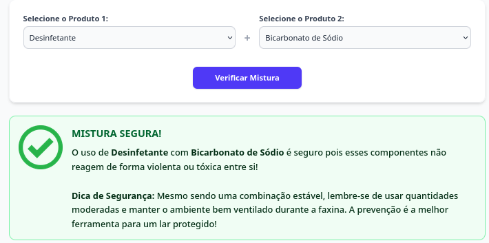

# 🧪 Misturas Seguras

Um simulador interativo e responsivo desenvolvido para conscientização sobre acidentes domésticos envolvendo a mistura inadequada de produtos de limpeza e substâncias do dia a dia. O sistema analisa a compatibilidade química entre dois insumos selecionados e alerta instantaneamente sobre reações perigosas, liberação de gases tóxicos ou riscos de inflamabilidade.

---

## 🛠️ Tecnologias Utilizadas

* **HTML5:** Estruturação semântica do formulário e dos blocos de feedback visual.
* **Tailwind CSS:** Estilização utilitária focada em responsividade
* **JavaScript Moderno (ES6+):** Manipulação avançada do DOM, persistência de estados com Arrays e arquitetura modularizada.

---
## 📷 Demonstração Visual

### 🟢 Simulação de Mistura Segura
Exemplo de feedback visual estável ao selecionar componentes que não reagem de forma perigosa:

  

---

### 🔴 Alerta de Mistura Perigosa
Exemplo de aviso crítico detalhando a reação tóxica imediata gerada pela combinação incorreta:

  

